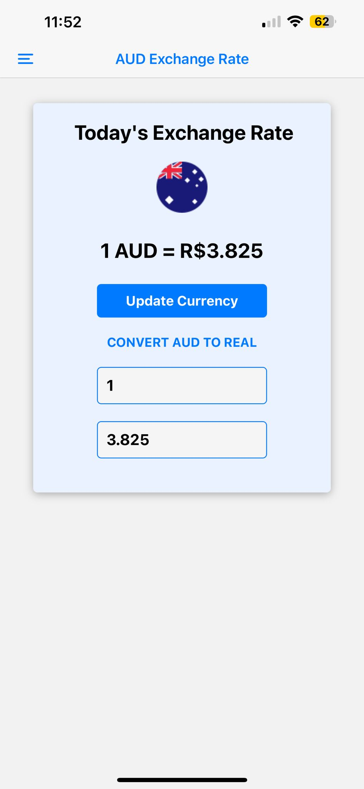
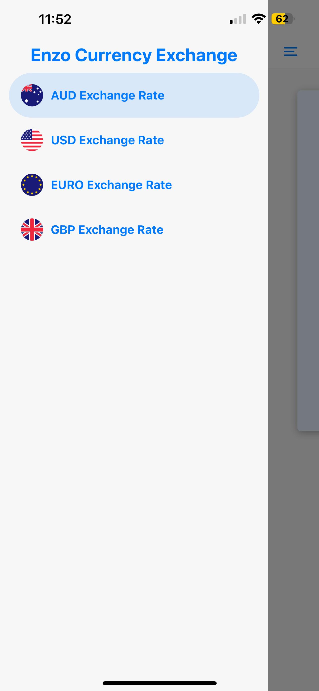

# Exchange Rate to BRL Project using API

This project integrates a currency API from [AwesomeAPI](https://docs.awesomeapi.com.br/api-de-moedas) to fetch real-time currency exchange rates. The user interface includes a **drawer** for navigation and is styled with a clean and modern layout. The API functions are handled through the `services` folder, while the **drawer component** is responsible for navigation and user interaction.

## Features

-  **React Native** for building the mobile application.
- **AwesomeAPI** for real-time currency exchange rates to BRL currency.
- **React Navigation** for the drawer component and navigation.

- ## Prerequisites

Make sure you have the following installed:

- **Node.js**: [Download here](https://nodejs.org/)
- **npm**: Node.js comes with npm.
- **Expo CLI**: Install Expo CLI globally using npm:
  ```bash
  npm install -g expo-cli
  
## Running the Project
To run the project using Expo:

1. **Start the Expo development server**:
   ```bash
   npx expo start
 2. After running this command, Expo will open a web page with a QR code. Scan this QR code using the Expo Go app on your mobile device to view the project live.

 Expo Go is available for both iOS and Android in their respective app stores.

## Project Structure
- **index.tsx**: The `index.tsx` file serves as the main entry point for the app. This section features an exchange rate converter for AUD currency.
- **usd.tsx**: This section features an exchange rate converter for USD currency to BRL.
- **euro.tsx**: This section features an exchange rate converter for EUR currency to BRL.
- **gbp.tsx**: This section features an exchange rate converter for GBP currency to BRL.
- **custom-drawer.tsx**: Defines the components, props, and styles used to structure and style the drawer.
- **service-folder**: It stores the functions to collect data from `[AwesomeAPI](https://docs.awesomeapi.com.br/api-de-moedas)`.

## Project's images
## **Converter Screen**


## **Drawer Screen**


